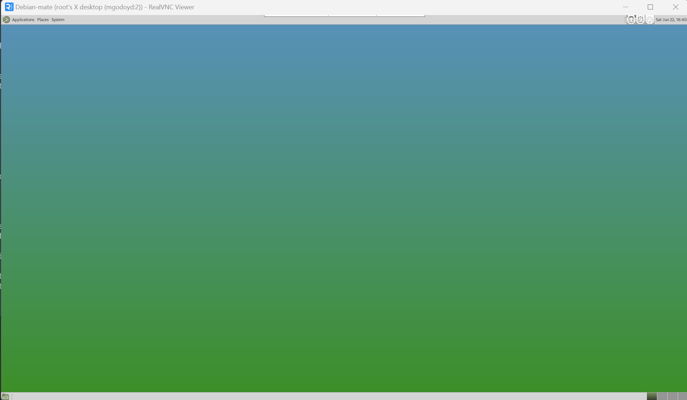
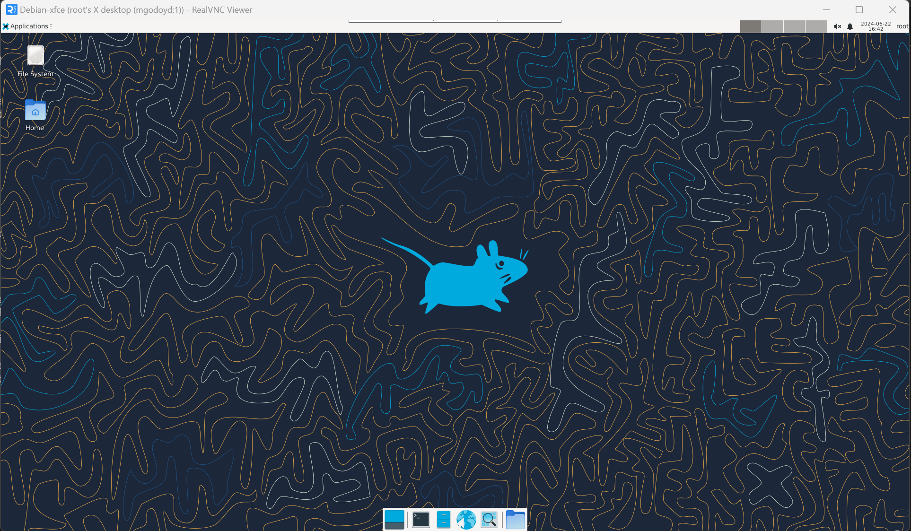
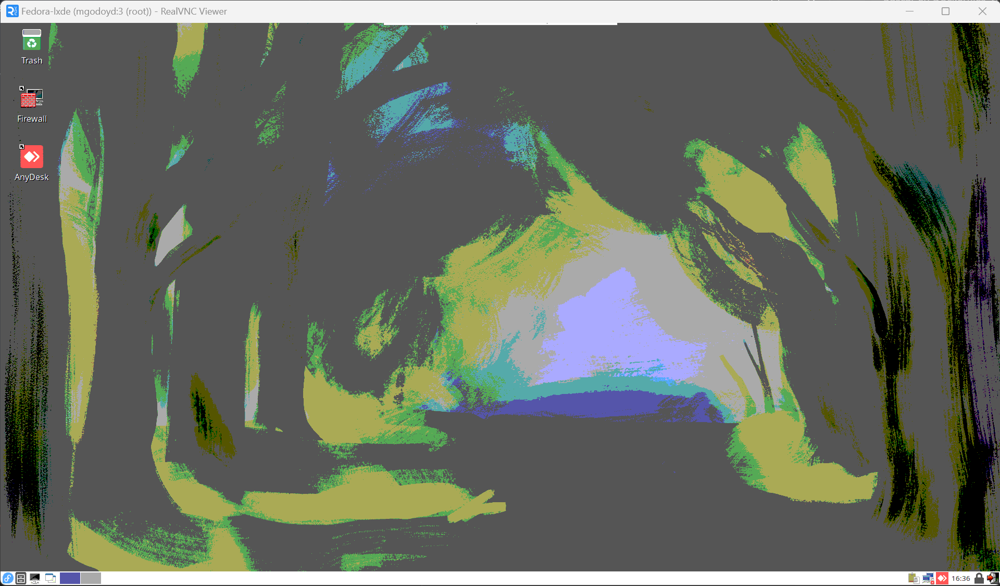

# DOCKER-GUI -- ANYDESK-VNC SERVER --

## Description

This repository contains Dockerfiles for creating Docker images based on different Linux distributions, specifically Debian and Fedora. Each generated image includes a VNC (Virtual Network Computing) server and AnyDesk. These tools allow you to remotely access and control an entire Linux desktop environment from anywhere.

### VNC Server

The VNC server provides remote access to a graphical desktop environment. With VNC, you can view the remote machine's desktop in real time and control its keyboard and mouse. It is ideal for tasks that require a graphical environment and for remote management of servers or workstations.

### AnyDesk

AnyDesk is a remote access tool known for its fast and reliable performance. It allows secure remote connections and is widely used for technical support, remote administration and real-time collaboration. AnyDesk offers advanced functionalities such as file transfer, session recording, and multiple monitor support.

### Docker and Terminal GUI

These Docker images also allow connection to a Docker terminal using a graphical user interface (GUI). This makes it easier to connect remotely to a Docker terminal, providing an improved and more intuitive user experience. The GUI allows you to interact with the Docker terminal visually, making administration and usage tasks more accessible.

### Benefits of these Images

- **Consistency**: By using Docker, you can ensure that the remote desktop environment is consistent across different systems and configurations.
- **Easy to use**: These images eliminate the need to manually configure VNC and AnyDesk on each machine, saving time and reducing configuration errors.
- **Portability**: You can deploy the remote desktop environment anywhere that supports Docker, including local servers, virtual machines, and cloud services.
- **Security**: Docker provides an isolated environment, which helps protect the host system from software running in containers.
- **GUI access**: It facilitates connection to Docker terminals through a GUI, improving the user experience and simplifying remote management.

---

## Repository Content

- `Dockerfile-debian-MATE`: Dockerfile to create a Debian-based image.
- `Dockerfile-debian-XFCE`: Dockerfile to create a Debian-based image.
- `Dockerfile-fedora-LXDE`: Dockerfile to create a Fedora-based image.
- `start-vnc.sh`: Script to start the VNC server.

## Previous requirements

- [Docker](https://www.docker.com/get-started) installed on your machine.

## Use

### Construction of Images

1. **Create a directory for the project**

    ```sh
    mkdir vnc_distribution_GUI
    cd  vnc_distribution_GUI
    ```
2.  **Create and edit the file `start-vnc.sh`**

    ```sh
    nano vnc_distribution_GUI/start-vnc.sh
    ```

    **Copy and paste the script content**

    ```sh
    #!/bin/bash 

    echo  'Actualizando el archivo /etc/hosts...'
     HOSTNAME=$(hostname) 
    echo  "127.0.1.1\t $HOSTNAME " >> /etc/hosts 
    
    echo  "Iniciando el servidor VNC en $RESOLUTION .. ."
     vncserver - matar :1 || true
     vncserver -geometry $RESOLUTION & 
    
    echo  "El servidor VNC se inició en $RESOLUTION ! ^-^" 
    
    echo  "Iniciando tail -f /dev/null..." 
    tail -f /dev/null
    ```

3. **Construction**
   * build the image from the directory created above:
    ```sh
    docker build -t vnc_distribution_GUI .
    ```

### Container Execution

1. **Distribution**
    ```sh
    docker run -itd --rm --name vnc_fedora --hostname fedora -p 5901:5901 vnc_fedora_lxde
    ```

### Access to images

1. **Distribution**
    ```sh
    docker exec -it vnc_fedora /bin/bash
    ```
2. **Script Execution**
    ```sh
    ./start-vnc-sh &
    ```
### Access to the Desktop Environment

#### VNC

To access the desktop environment using VNC, you can use a VNC client (for example, [RealVNC](https://www.realvnc.com/en/connect/download/viewer/)) and connect to:

- **Distribution**: `localhost:5901`, `localhost:5902`, `localhost:5902`

#### AnyDesk

To log in using AnyDesk, open the AnyDesk app and connect using the ID displayed on the AnyDesk server in the container.

### DEBIAN-MATE


### Image Download from Docker Hub

Si prefieres descargar la imagen preconstruida desde Docker Hub, puedes hacerlo con el siguiente comando:

-[Image](https://hub.docker.com/repository/docker/mgodoyd/vnc_debian_mate)

### DEBIAN-XFCE


### FEDORA-LXDE



